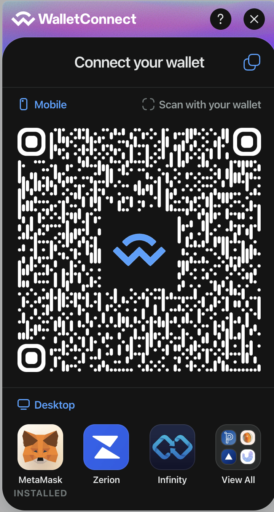
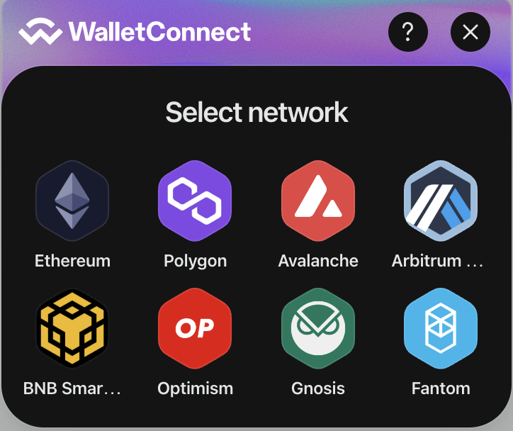
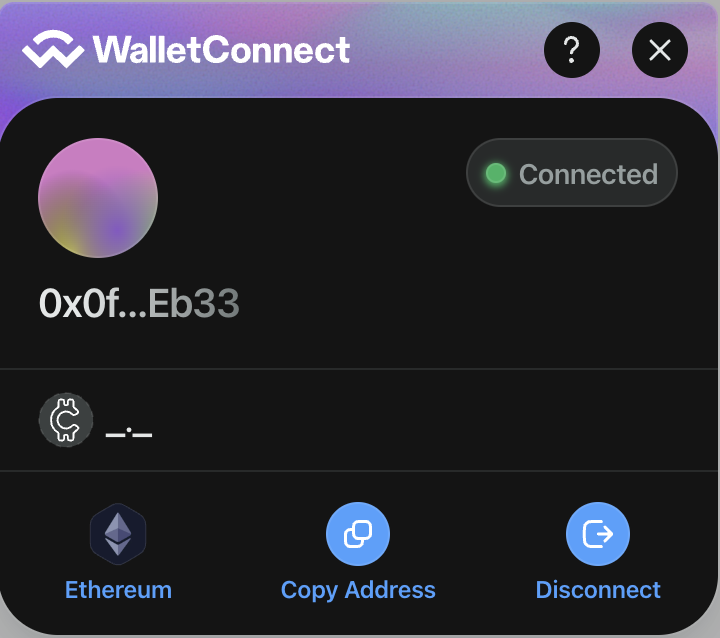

# [Web3 Wallet general solution template]

Web3 Wallet Template is a free and open source template built in React.js and based on the latest version of the Material UI framework. Built-in integration with web3modal wagmi an out-of-the-box connected wallet contract, It features over 100 UI elements, plugins, and example based built with React components.







## Material

This library is based on the latest version of the [MaterialUi](https://mui.com/core/) which brought many improvements.

## Workflow

This product is built using the following widely used technologies:

- React.js front-end library
- tailwindcss CSS Framework
- materia-ui
- NPM & Yarn

### Using Yarn

3. Make sure you have [Yarn](https://yarnpkg.com/) installed.
4. After installing `yarn`, open a terminal and run `yarn install` in the main folder to download all project dependencies.

```
yarn install
```

5. Then start the app in development mode by running the following command in terminal:

```
yarn dev
```

6. Open http://localhost:5173/wallet to view it in the browser. Any changes you make to the code will be automatically reflected in the browser.

7. If you want to generate the production files, change the `homepage` value from the `package.json` to the domain name that the app will be hosted on, and then run the following command in the terminal:

```
yarn build
```

### Using NPM

3. Make sure you have [Node.js](https://nodejs.org/en/) installed. Make sure the installed Node version is >= 16.0 and of npm >= 5.6

4. After installing Node.js, open a terminal and run `npm install` in the main folder to download all project dependencies. You'll find them in the `node_modules/` folder.

```
npm install
```

5. Then start the app in development mode by running the following command in terminal:

```
npm run start
```

6. Open http://localhost:5173/wallet to view it in the browser. Any changes you make to the code will be automatically reflected in the browser.

7. If you want to generate the production files, change the `homepage` value from the `package.json` to the domain name that the app will be hosted on, and then run the following command in the terminal:

```
npm run build
```

## Browser Support

At present, we officially aim to support the last two versions of the following browsers:

 